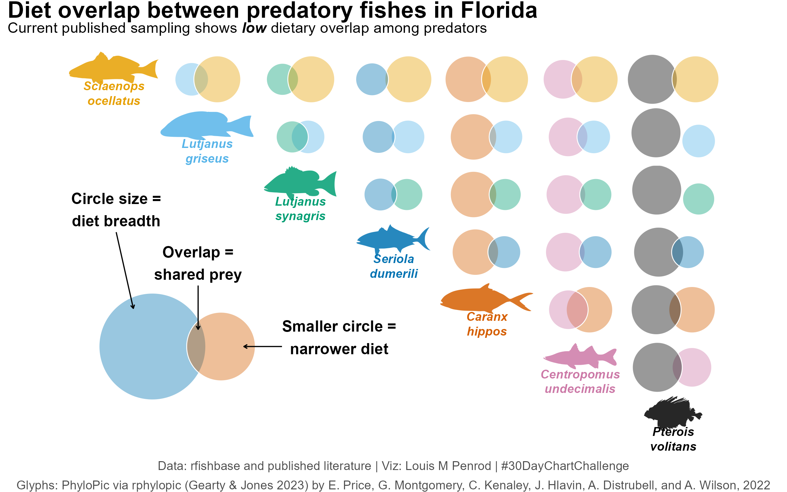
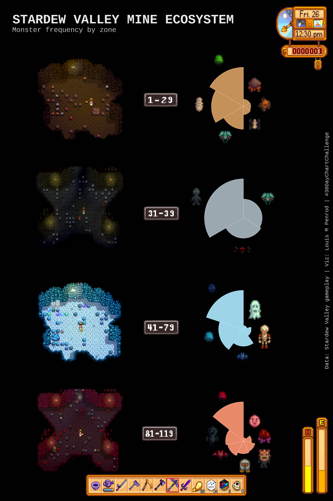
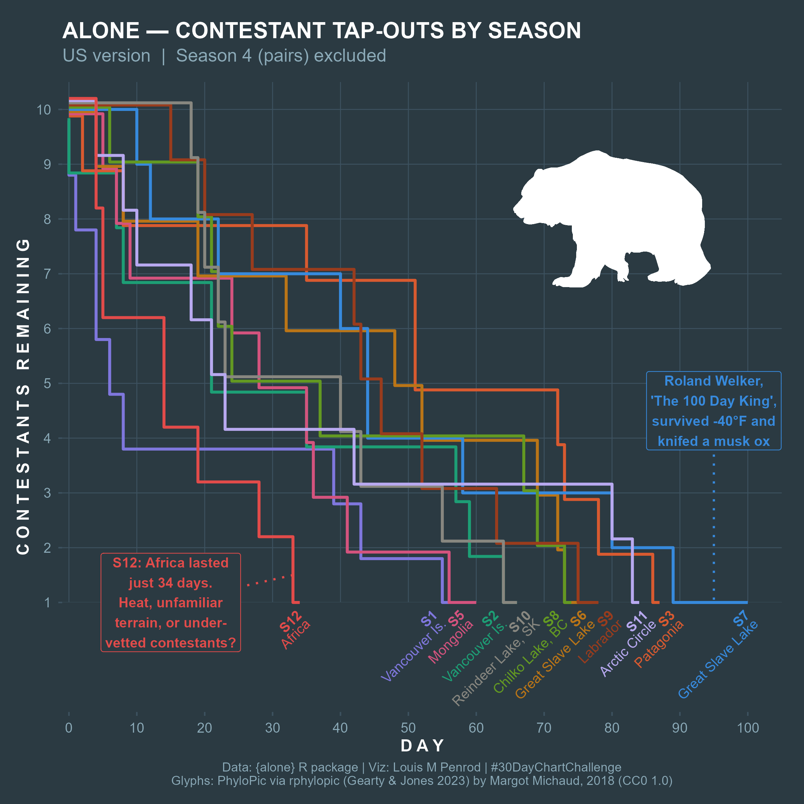
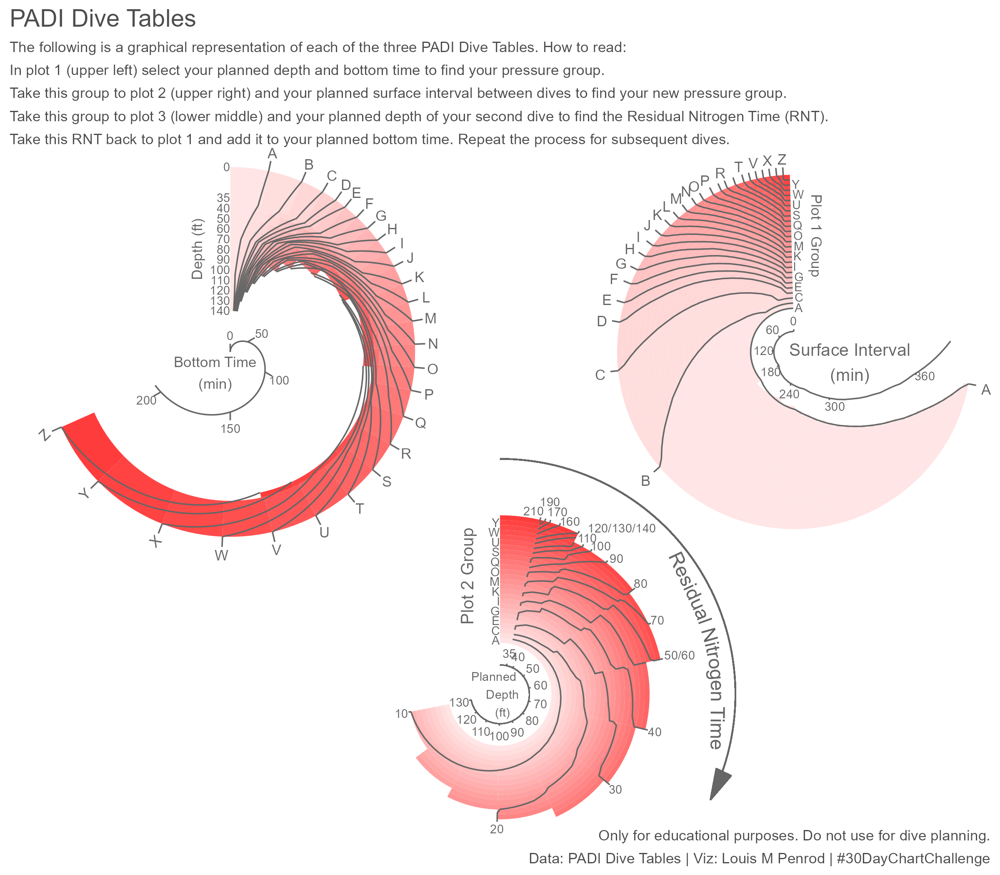
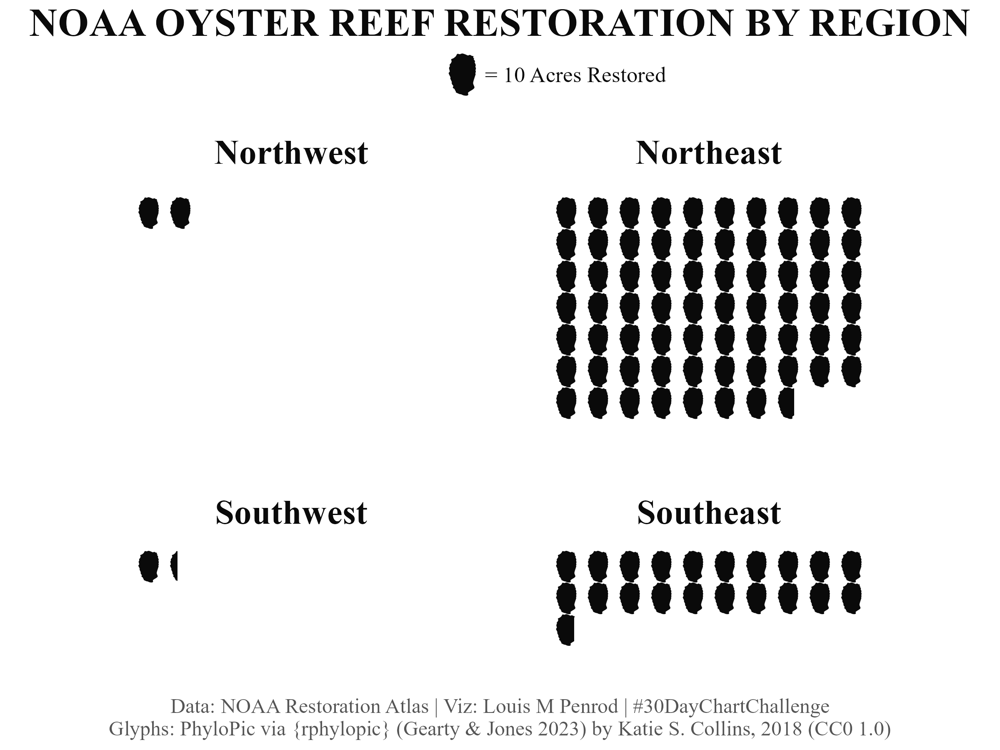

# Introduction

For the past few years, I've sat on the sidelines while others created some really great visuals for the #30DayChartChallenge. This year, I decided to participate.

You can find my contributions to the challenge on my [Posit Connect Cloud](https://019d11a5-ceb7-a2e0-a943-4886b74d3eac.share.connect.posit.cloud/).

My goal was to hit all 30 days. Maybe going from 0 to 30 days was not a great plan because I missed that target. I only got 16, but still had lots of fun and learned a lot.

This post will reflect on that challenge, some of the charts I made, and some realizations I had along the way.

# Background

There was a great set of prompts this year. Prompts are in sets of 6 days within a theme.

{fig-alt="The specific groups and days of challenges for the 2026 #30DayChartChallenge"}

Prompts can be taken literally or interpreted creatively.

I got this list two weeks before the start of April and began planning immediately.

I wanted to focus mainly on biological and ecological data, but some topics lent themselves well to other data, and some days were specific data days.

# Top Charts

Let's start with my favorite charts.

## Comparisons - Day 5: Experimental

My all-time favorite is from Comparisons - Day 5: Experimental.

{fig-alt="Eulerr diagrams set up in a matrix arrangement showing diet overlap of predatory fishes in Florida. The size of the circle shows the size of the diet (scaled to the max diet size so the circle size is the same across plot for the same species). The overlap shows the proportion of prey shared. Very little overlap among species but that is a data shortage issue."}

I've been thinking about this type of visualization for years. I've always thought it would be interesting to have a Venn diagram where the size is proportional to the frequency of each group and the overlap proportional to the number of common values.
Turns out, that already exists; it is just not commonly used. It is called a Euler diagram.
This challenge gave me the opportunity to test it out, but I didn't just want to do something novel, not just a single Euler diagram. I settled on a matrix plot. With this structure, I needed groups that have some qualitative trait that overlaps. I was initially thinking about species overlap in different ecosystems, but that data was difficult to find. I decided on diet overlap between predators in Florida waters. Even that was difficult to find in a standardized format. I'll admit, the data is still not great, but it is the viz I wanted to focus on for this challenge. Overall, I think it turned out really well. As noted, this is an uncommon viz and I think it is pretty underutilized. I'm curious to see how this could be used in the future for other qualitative data.

## Distributions - Day 7: Multiscale

Next favorite is Distributions - Day 7: Multiscale.

<iframe src="day07_multiscale.html" height="760" title="Distributions - Day 7: Multiscale" style="width:100%; border:none;"></iframe>

You can also view this [full-page in its own tab](https://019d11a5-ceb7-a2e0-a943-4886b74d3eac.share.connect.posit.cloud/).

I like this one for two reasons. First, I got to explore a new tool. For this I used Observable JS within Quarto. This allowed me to apply the "Multiscale" theme from the prompt. The main view is the whole US, and you can click on a state to zoom into the specific state value.
The second reason is because the data is something I am interested in. I've noticed in recent years there have been a lot of political moves and decisions that are centered around agriculture. Particularly, actions that destabilize or reduce agriculture. In my area, we are seeing lots of agricultural land being sold off for housing or commercial development. That is land that we will never get back. I wanted to see how prevalent this was in other areas. I definitely see myself looking into this data more, and I'm very interested in seeing when the next data cut comes.

## Relationships - Day 13: Ecosystems

My last favorite is Relationships - Day 13: Ecosystems.

{fig-alt="Four radial bar charts arranged vertically, each representing one zone of the Stardew Valley mines: Brown, Gray, Frozen, and Lava. Each chart shows the relative frequency of monster types found in that zone, with bars radiating outward from the center. A pixel art image of each monster type sits at the tip of its corresponding bar. An example level from the game shown next to each plot. The charts reveal how the monster community composition shifts as you descend deeper into the mines."}

This one was very fun to make because the data did not exist. Stardew Valley has a lot of its game stats in the [Wiki](https://stardewvalleywiki.com/Stardew_Valley_Wiki), but not this data. Therefore, we had to collect the data. This involved several rounds of doing full runs through the mines. My partner played the game, and I recorded the data.
This was also the plot where I learned something new and was almost immediately able to integrate it into my work. This plot required that I arrange distinct plots and images in a custom arrangement, moving and scaling as needed. This used functionality in the `{patchwork}` package that I have not encountered before, particularly `wrap_elements()`. This really helped in getting things arranged properly.

## Honorable Mention

Comparisons - Day 4: Slope

{fig-alt="A line plot of the contestant tap-outs through time by season on the show Alone (US produced version with season 4 excluded as that was pairs). This shows the draw-down from 10 contestants to 1. Season 7 has the only contestant to make it to 100 days. That season has an annotation “Roland Welker, ‘The 100 Day King’, survived -40°F and knifed a musk ox.” The newest season (season 12) was in Africa and has the annotation “S12: Africa lasted just 34 days. Heat, unfamiliar terrain, or under-vetted contestants?” Data is from the {alone} R package."}

I just like how this one turned out. Nuff said.

# Misses

I'll admit, some were not winners.

My biggest misses were

1. Distributions - Day 8: Circular, which was just too busy.

{fig-alt="Three circular diagrams reimagining the PADI repetitive dive planning tables, using a consistent color scheme tied to pressure group letters throughout all three. Instructions at the top explain how to use them. The first diagram determines a diver's pressure group after an initial dive based on depth and bottom time, with pressure group letters labeled on the output. The second diagram tracks nitrogen off-gassing during surface intervals, showing how a diver moves between labeled pressure groups over time. The third diagram determines the Residual Nitrogen Time (RNT) for a repetitive dive based on the diver's pressure group and planned depth, with both starting pressure groups and RNT values labeled. All three diagrams use the same color palette mapped to pressure group letters, allowing visual continuity across the planning workflow."}

2. Comparisons - Day 2: Pictogram because oysters are a bit too blobby to be effective in a pictogram.

{fig-alt="Pictogram showing oyster reef restoration in acres by region. Each oyster = 10 acres. The Northeast dominates with more than all other regions combined. Southeast follows. The Northwest and Southwest have <= 20 acres each."}

# Lessons Learned

I'll start by saying I learned a lot, but one lesson stood out the most. The biology/ecology data scene is a mess. That is honestly a hard thing to come to realize, but I encountered this with almost every bio/eco-related dataset.

For a field and community that try to be as open as possible, there are many problems getting data, even data that is technically public.

The issues can be boiled down to existence, availability, and quality.

On the existence front, this is a common problem: the data is just not available or does not exist. Many ideas I had that I was confident would have data somewhere did not. Some had to exist due to results published somewhere but the data was not available.

Even when the data exists, it may not be easily accessible. The data might not be in a digitized format. In several cases, I had to extract data from publications or images.
Often, data is buried in complex webpages requiring significant navigation to actually get to something that exports the data. When you do find the portal, it may be fractured into many parts with minimal information on the stratification or may need to combine many datasets to get what is needed. For example, the USDA NASS site has 6 levels of filters that restrict down to a very fine focus, which is not helpful if you want to look across agricultural products or years. That is when the data is in a downloadable state. For several of these challenges, the data I needed was only available through an interactive web tool. There was no way to download the data you were seeing. For two, I had to deeply explore how the website grabbed the data to display, figure out the API, and build a tool to grab the data. This was a fun and incredibly rewarding process, but something I feel should not be necessary. Both were from government organizations where the data is supposed to be publicly available. I guess it is, but just not in an easily accessible format.

Finally, on quality, data could have inconsistent formats or values or problematic documentation. In one case, a multi-year dataset export had a weighting that was used to calculate a score across different countries. However, the weighting only applied to the last year. Previous years had different weightings, but that data was not in the available exports. This prevented accurate multi-year comparisons. On documentation, I surprisingly had cases where there was no documentation or metadata to explain the data, or too much documentation. In this latter case, there was a 50-page document accompanying the download to explain the data. While I appreciate thorough documentation, it should not require hours of reading technical documents to understand a single dataset.

I will say, these did not apply only to biological and ecological data, but I wanted to believe that open science had made some progress to where it would not be THIS prevalent.

# Conclusion

I want to do something about this data issue. Going forward, I'm going to try to find important biological/ecological datasets that are difficult to access and build tools so everyone can access the data. Get the data into people's hands, and it could be used for something incredibly useful.

Be on the lookout for new content exploring this data issue, cool bits of code that I picked up during this challenge, and some of the days I missed.
