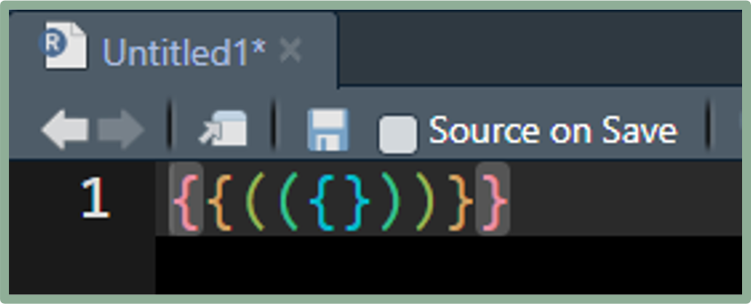
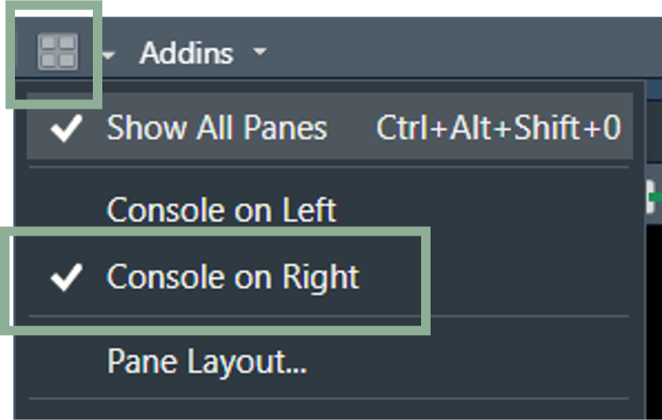

# Rainbow Parentheses

Rainbow parentheses help keep track of your parentheses and brackets by coloring them in sets. 

Turn them on by:

1 - Go to Tools  
2 - Global Options...  
3 - Code  
4 - Display  
5 - Check "Use rainbow parentheses"

Your parentheses and brackets will now look like:
{fig-alt="rainbow parentheses in RStudio"}

# Pane Layout

Changing the pane layout can simplify your workflow. 

The script and console both want to be tall, but they are stacked by default. 

Putting them side-by-side can help line up your code and output. 

To change the layout, click the Workspace Pane button then click "Console on the Right"

{fig-alt="Pane layout drop down in RStudio with Console on Right options highlighted"}

